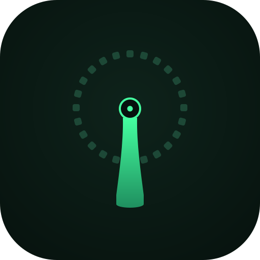
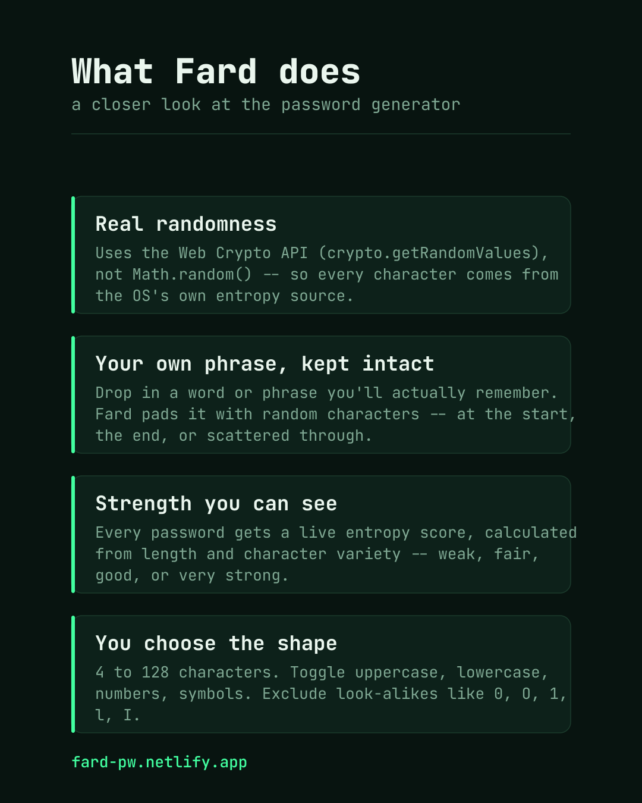
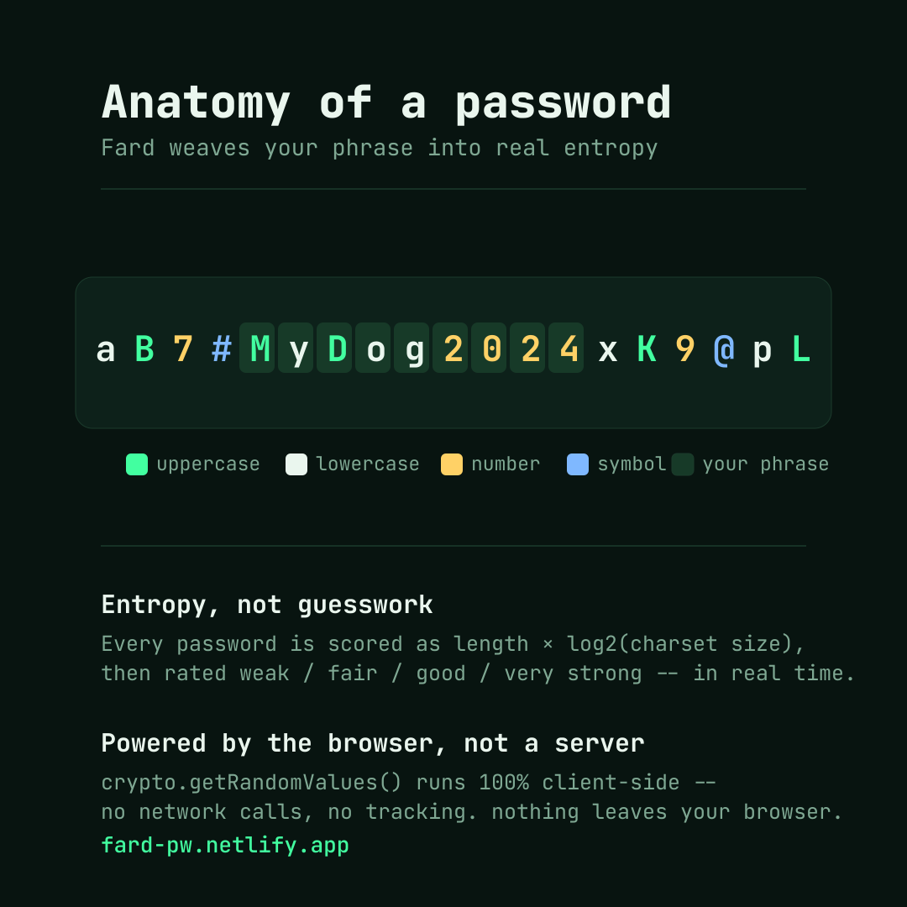

<div align="center">
  

# Fard (فَرْد)

</div>

<div align="center">


### *Uniqueness isn't special. It's expected.*

**A cryptographically secure password generator that doesn't compromise.**

[🚀 Live Demo](https://fard-pw.netlify.app/) • [📖 Features](#-features) • [💬 Report Issue](https://github.com/mehedyk/Fard/issues)

</div>

---

## ✨ What is Fard?

**Fard** (فَرْد) means "unique" or "singular" in Arabic. This password generator lives up to its name by creating unique, cryptographically secure passwords with the Web Crypto API. Every character comes from your browser's secure random number generator, never from `Math.random()`.

### 🎯 Philosophy

> In a world where data breaches are common, weak passwords are inexcusable. Fard makes strong passwords the easy default: unpredictable, generated locally, and scored honestly.

---

## 🌟 Features

<div align="center">
  
</div>
<br>

<table>
<tr>
<td width="50%">

### 🔒 **Cryptographically Secure**
Uses `crypto.getRandomValues()` with rejection sampling to avoid modulo bias. No `Math.random()` anywhere.

### 🎨 **Beautiful Dark/Light Themes**
Switch between a dark and a light "eggshell" theme with the sun/moon toggle in the header. Your choice is remembered.

### 🌈 **Color-Coded Characters**
Every character type has its own color (uppercase, lowercase, numbers, symbols), so you can read a password at a glance.

### 🧩 **Custom Phrase Integration**
Include a memorable word or phrase and Fard weaves random characters around it. Your phrase is highlighted in pink. It adds no entropy: the strength score counts only the random characters.

</td>
<td width="50%">

### ⚙️ **Flexible Configuration**
- Password length: 4-128 characters (slider, +/- buttons, or exact number)
- Uppercase, lowercase, numbers, symbols
- Character exclusion options
- Smart placement controls
- The password updates live as you change settings

### 📊 **Real-time Strength Analysis**
Instant entropy calculation with a five-level, color-coded strength indicator.

### 📱 **Mobile-First Layout**
Built for phones first: settings come first, then your password. On desktop everything fits on one screen with the password up top.

### 🎲 **Smart Generation**
Includes at least one character from each selected type whenever the length leaves room for it.

</td>
</tr>
</table>

---

## 🚀 Getting Started

### Quick Start

1. **Clone the repository:**
   ```bash
   git clone https://github.com/mehedyk/Fard.git
   cd Fard
   ```

2. **Open `index.html` in your browser:**
   ```bash
   # On macOS
   open index.html
   
   # On Linux
   xdg-open index.html
   
   # On Windows
   start index.html
   ```

3. **Generate passwords immediately!** No build process, no dependencies, no hassle.

### 📦 Or Download

Download the repository as a ZIP and open `index.html`. Everything the page needs (fonts and icons included) is in the repo, so it also runs offline.

---

## 🎮 Usage

### Basic Password Generation

1. **Adjust length** using the slider, the +/- buttons, or by typing a number (4-128 characters)
2. **Select character types** (uppercase, lowercase, numbers, symbols)
3. **Watch the password update**, or click **"Generate Password"** 🎲 for a fresh one
4. **Copy with one click** 📋 (the button, or tap the password itself)

### Advanced Features

#### 🔤 Include Custom Phrases

Add memorable words or phrases that will be preserved in your password:

<div align="center">
  
</div>
<br>

```
Phrase: "MyDog2024"
Result: aB7#MyDog2024xK9@pL
```

**Placement Options:**
- **Random** - Phrase appears anywhere in the password
- **Beginning/End** - Randomly chooses start or end position
- **Always Beginning** - Phrase always starts the password
- **Always End** - Phrase always ends the password

#### 🚫 Exclude Ambiguous Characters

Avoid confusing characters like `0O1lI`:

```
Exclude: 0O1lI
Generated: aBcDeFgHjKmNpQrStUvWxYz
```

---

## 🛡️ Security Features

### Cryptographic Randomness

Fard uses the Web Crypto API (`crypto.getRandomValues()`), which provides:

- **A CSPRNG** seeded by the operating system's entropy sources
- **No predictable patterns** unlike `Math.random()`
- **Unbiased selection** via rejection sampling, so no character is more likely than another
- **Secure shuffling**: the Fisher-Yates shuffle also uses the CSPRNG

### Password Strength Calculation

Strength is an entropy estimate in bits:

```
entropy = randomLength × log₂(charsetSize)
randomLength = password length − phrase length
```

- **Your phrase counts as 0 bits.** Fard assumes an attacker could guess it, so only the random characters are credited.
- **Placement adds a little:** a random phrase position adds log₂(positions) bits, and "beginning or end" adds 1 bit.
- **Excluded characters** shrink the charset and are reflected in the score.

**Strength ratings:**
- 🔴 **Weak** (< 40 bits)
- 🟠 **Fair** (40–64 bits)
- 🟡 **Good** (65–79 bits)
- 🔵 **Strong** (80–99 bits)
- 🟢 **Very Strong** (≥ 100 bits)

The score is guidance, not a guarantee. It assumes the attacker knows the character set you chose.

---

### No Data Collection

- ✅ **100% client-side** - passwords never leave your browser
- ✅ **No analytics** - zero tracking or telemetry
- ✅ **No external requests** - fonts and icons are bundled, so it works offline (the Fard Vault link opens another site only if you click it)
- ✅ **Privacy first** - your secrets stay secret

---

## 🎨 Themes

Fard has a dark theme (default) and a light "eggshell" theme, switched with the sun/moon toggle in the header. Your choice is saved in your browser's `localStorage` (the only thing Fard stores) and never leaves your device.

---

## 🔧 Technical Details

### Built With

- **Pure HTML/CSS/JavaScript** - No frameworks, no bloat
- **Web Crypto API** - Industry-standard cryptography
- **JetBrains Mono** - bundled locally under the SIL Open Font License (see `assets/fonts/`)
- **CSS Custom Properties** - Dynamic theming system

### Browser Compatibility

Generation needs the Web Crypto API and CSS custom properties. The Copy button needs the async Clipboard API, which sets the practical minimum below (approximate, not formally tested):

| Browser | Approx. minimum |
|---------|----------------|
| Chrome | 66+ |
| Firefox | 63+ |
| Safari | 13.1+ |
| Edge | 79+ |

The Clipboard API also requires a secure context (HTTPS or localhost).

### File Structure

```
Fard/
├── index.html          # The whole app (HTML, CSS, JS)
├── assets/             # Logo, favicons, README images
│   └── fonts/          # JetBrains Mono (woff2) + OFL license
├── brand/              # Animated logo exports (GIF/MP4) for social posts
├── _headers            # Netlify security headers (CSP)
├── LICENSE
├── SECURITY.md
└── README.md
```

---

## 💡 Why Fard?

### At a Glance

| Feature | Fard |
|---------|------|
| Cryptographically secure randomness | ✅ |
| Works offline | ✅ |
| Custom phrase integration | ✅ |
| Dark and light themes | ✅ |
| Color-coded password characters | ✅ |
| Mobile-first layout | ✅ |
| No tracking or analytics | ✅ |
| Source available for inspection | ✅ (proprietary license, see below) |

### Use Cases

- 👤 **Personal** - strong passwords for your own accounts
- 📚 **Education** - see how entropy and secure randomness work
- 🛠️ **Development** - generate secrets for your own projects

Anything beyond personal use needs written permission (see the license).

---

## 📋 Roadmap

- [ ] Password history with secure storage
- [ ] Bulk password generation
- [ ] Custom symbol sets
- [ ] Passphrase generator mode
- [ ] Password strength requirements checker
- [ ] Export passwords to encrypted file

---

## 🤝 Contributing

### 🚨 IMPORTANT: Read License First

**Fard is proprietary software.** Before contributing:

1. Read the [LICENSE](#-license) section carefully
2. Understand that all contributions become proprietary
3. Contact [@mehedyk](https://github.com/mehedyk) for permission

### How to Contribute (If Approved)

1. Fork the repository
2. Create your feature branch (`git checkout -b feature/AmazingFeature`)
3. Commit your changes (`git commit -m 'Add some AmazingFeature'`)
4. Push to the branch (`git push origin feature/AmazingFeature`)
5. Open a Pull Request

---

## 📜 License

```
Copyright (c) 2025 @mehedyk (https://github.com/mehedyk)
All Rights Reserved.

PROPRIETARY LICENSE

This software and associated documentation files (the "Software") are the 
exclusive property of @mehedyk. 

TERMS AND CONDITIONS:

1. RESTRICTIONS
   ❌ NO reproduction, modification, or distribution
   ❌ NO creation of derivative works
   ❌ NO reverse engineering or decompilation
   ❌ NO commercial or non-commercial use without written permission
   ❌ NO public hosting without explicit authorization
   ❌ NO removal or alteration of copyright notices

2. PERMITTED USES
   ✅ Personal inspection of source code for security review
   ✅ Running the software locally for personal password generation
   ✅ Reporting security vulnerabilities to the author

3. ATTRIBUTION
   Any permitted use must maintain all copyright notices and attribution
   to @mehedyk (https://github.com/mehedyk).

4. NO WARRANTY
   THE SOFTWARE IS PROVIDED "AS IS", WITHOUT WARRANTY OF ANY KIND, EXPRESS
   OR IMPLIED, INCLUDING BUT NOT LIMITED TO THE WARRANTIES OF MERCHANTABILITY,
   FITNESS FOR A PARTICULAR PURPOSE AND NONINFRINGEMENT.

5. LIABILITY
   IN NO EVENT SHALL THE AUTHOR BE LIABLE FOR ANY CLAIM, DAMAGES OR OTHER
   LIABILITY ARISING FROM THE USE OF THE SOFTWARE.

6. PERMISSION REQUESTS
   For licensing inquiries, commercial use, or permission requests:
   Contact: https://github.com/mehedyk

VIOLATION OF THESE TERMS CONSTITUTES COPYRIGHT INFRINGEMENT AND MAY RESULT
IN LEGAL ACTION.
```

### 🔴 License Summary (Non-Legal)

**You MAY:**
- ✅ Use Fard locally for personal password generation
- ✅ Inspect the code to verify security claims
- ✅ Report bugs and vulnerabilities

**You MAY NOT:**
- ❌ Copy, modify, or redistribute the code
- ❌ Use the code in your own projects
- ❌ Host Fard publicly without permission
- ❌ Remove the author's credits
- ❌ Create derivative works

**Want to use Fard commercially?** Contact [@mehedyk](https://github.com/mehedyk) for licensing options.

---

## 🐛 Bug Reports & Security

### Found a Bug?

Please report issues with:
- **Description** - What happened?
- **Steps to reproduce** - How can we see it?
- **Expected behavior** - What should happen?
- **Browser & OS** - Your environment details

### 🔒 Security Vulnerabilities

If you discover a security issue:

1. **DO NOT** open a public issue
2. **Email** security details privately to [@mehedyk](https://github.com/mehedyk)
3. Include detailed reproduction steps
4. Allow reasonable time for a fix before disclosure

---

## 👨‍💻 Author

<div align="center">


### **S.M. Mehedy Kawser**
### [@mehedyk](https://mehedy.netlify.app)

<!--- *Software Developer • Security Enthusiast • Open Source Advocate* -->

[](https://github.com/mehedyk)
[](https://mehedy.netlify.app)

</div>

---

**About the Author:**

Passionate about creating secure, privacy-focused tools that respect users. Fard represents a commitment to making strong security accessible to everyone without compromising on design or usability.

> "Security shouldn't be an afterthought, and good design shouldn't sacrifice functionality."

---

## 📞 Contact & Support

<div align="center">

**Questions? Licensing inquiries? Feature requests?**

[Open an Issue](https://github.com/mehedyk/Fard/issues) • [Visit Portfolio](https://mehedy.netlify.app) • [Email](mailto:kawser2305341202@diu.edu.bd)

### Get in Touch

- 💼 **Professional Inquiries:** [Portfolio](https://mehedy.netlify.app)
- 🐛 **Bug Reports:** [Issue Tracker](https://github.com/mehedyk/Fard/issues)
- 🔒 **Security:** Private disclosure to [@mehedyk](https://github.com/mehedyk)
- 📜 **Licensing:** Contact for commercial use permissions

</div>

---

## ⭐ Show Your Support

If you find Fard useful:

- ⭐ **Star this repository** to show appreciation
- 🐦 **Share** with others who need secure passwords
- 💬 **Provide feedback** to help improve the tool

---

<div align="center">

### 🔐 Stay Secure. Stay Unique. Stay Fard.

**Made by [@mehedyk](https://github.com/mehedyk)**

*Fard (فَرْد) - Because your security deserves uniqueness.*

---


</div>